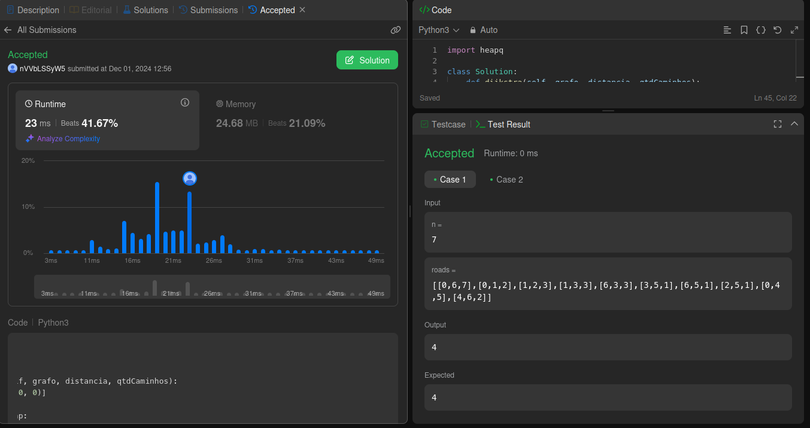
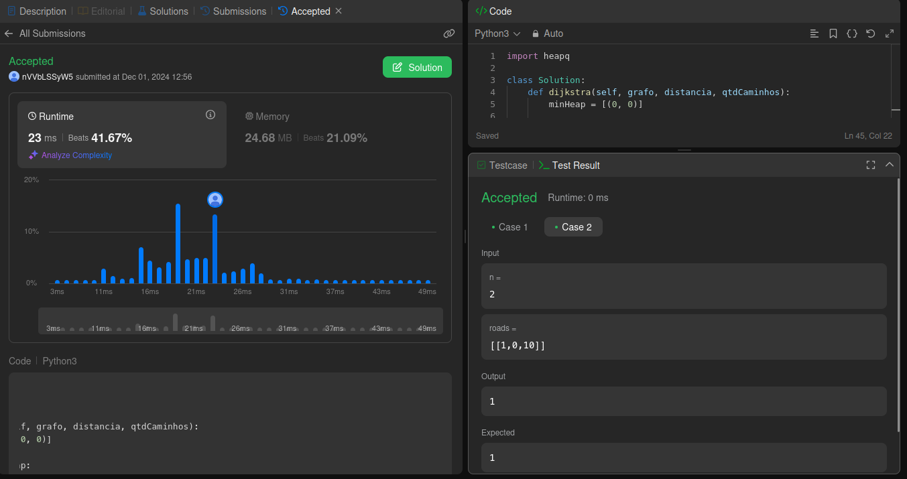
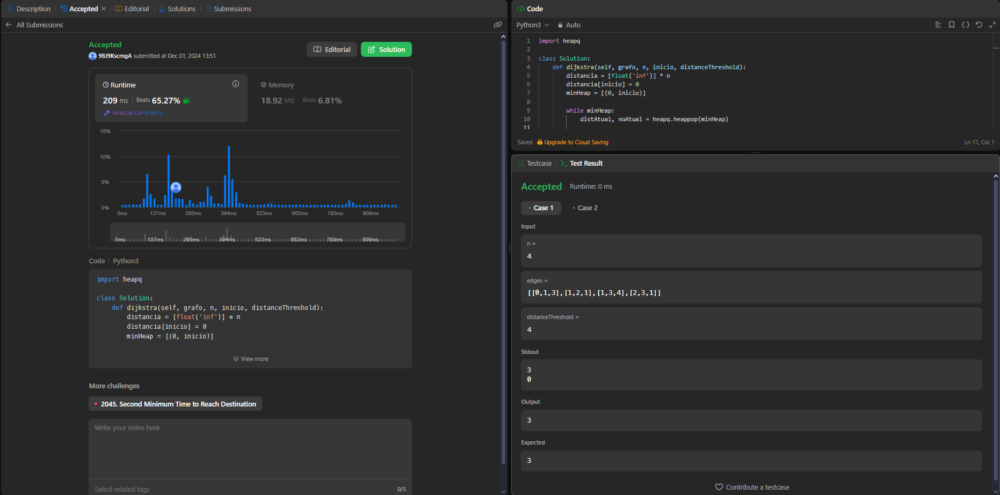
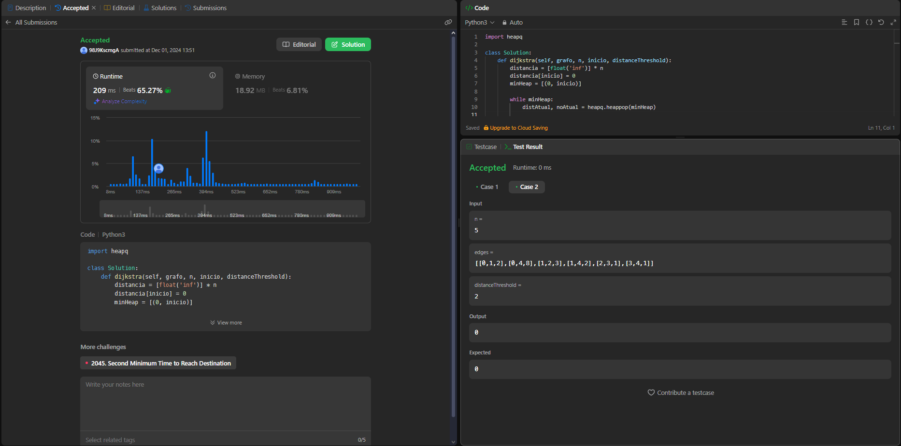
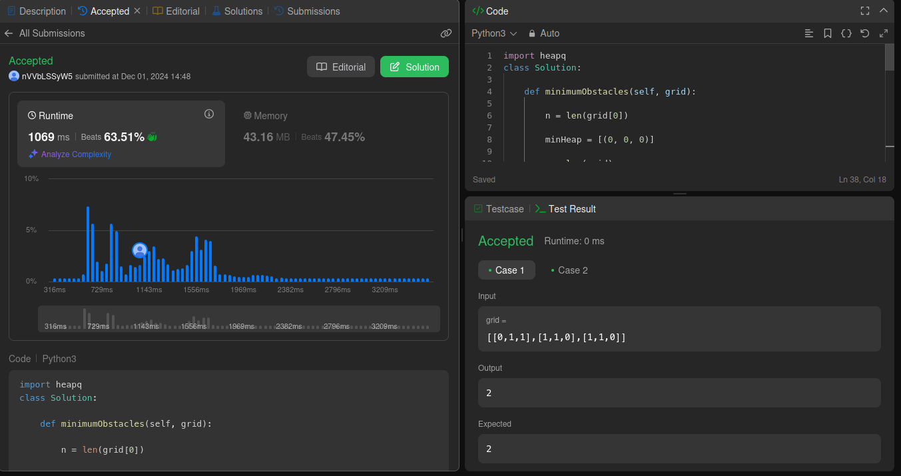
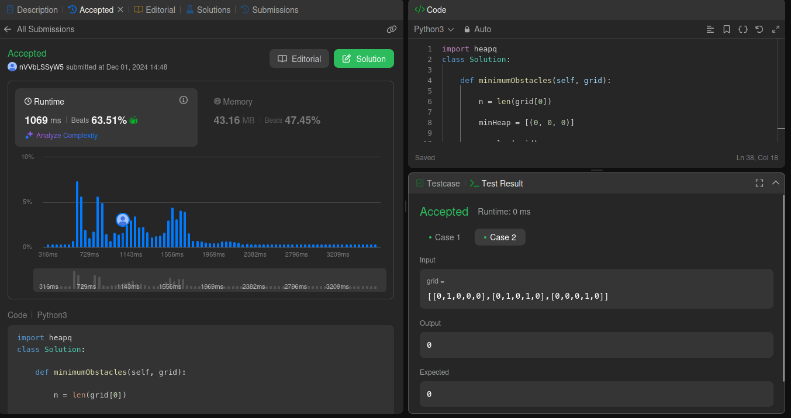
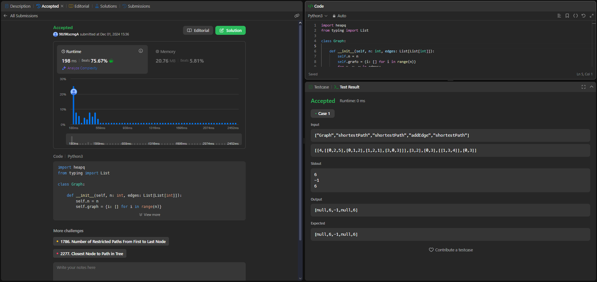

# Grafos2 Problemas do LeetCode

**Número da Lista**: 52<br>
**Conteúdo da Disciplina**: Grafos 2<br>

## Alunos
|Matrícula | Aluno |
| -- | -- |
| 22/1031265  |  Carlos Eduardo Rodrigues |
| 22/1037993 |  Patrícia Helena Macedo da Silva |

## Sobre
Este repositório contém soluções para problemas de programação resolvidos no LeetCode. Foram selecionadas 2 questões de dificuldade "Hard" e 2 de dificuldade "Medium". Cada solução é acompanhada pelo código correspondente.

Exercícios Abordados
| Código do Problema | Nome do Problema | Dificuldade |
| ------------------ | ---------------- | ----------- |
| 2642. |[Design Graph With Shortest Path Calculator](https://leetcode.com/problems/design-graph-with-shortest-path-calculator/description/) | Difícil |
| 1568. |[Minimum Number of Days to Disconnect Island](https://leetcode.com/problems/minimum-number-of-days-to-disconnect-island/description/) | Difícil |
| 1334. |[Find the City With the Smallest Number of Neighbors at a Threshold Distance](https://leetcode.com/problems/find-the-city-with-the-smallest-number-of-neighbors-at-a-threshold-distance/description/) | Médio |
| 2290. |[Minimum Obstacle Removal to Reach Corner](https://leetcode.com/problems/minimum-obstacle-removal-to-reach-corner/description/) | Difícil |
| 1976. |[Number of Ways to Arrive at Destination](https://leetcode.com/problems/number-of-ways-to-arrive-at-destination/description/)  | Médio |

## Screenshots

### [1976. Number of Ways to Arrive at Destination](https://leetcode.com/problems/number-of-ways-to-arrive-at-destination/description/)



### [1334. Find the City With the Smallest Number of Neighbors at a Threshold Distance](https://leetcode.com/problems/find-the-city-with-the-smallest-number-of-neighbors-at-a-threshold-distance/description/)



### [2290. Minimum Obstacle Removal to Reach Corner](https://leetcode.com/problems/minimum-obstacle-removal-to-reach-corner/description/)



### [2642. Design Graph With Shortest Path Calculator](https://leetcode.com/problems/design-graph-with-shortest-path-calculator/description/)



## Instalação 
**Linguagem**: Python<br>

1. Navegue até a pasta do problema desejado. Ex: `cd 1976`
2. Rode o algoritmo com o comando:

```
python3 solucao.py
```

## Uso 
Basta executar o algoritmo.

## Outros 
Se preferir testar diretamente no LeetCode, basta copiar o código sem a main.

## Vídeo


